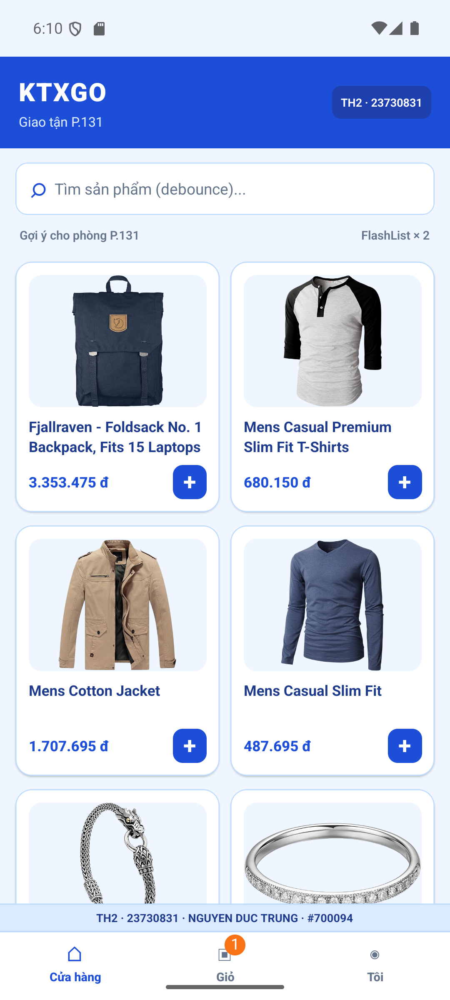
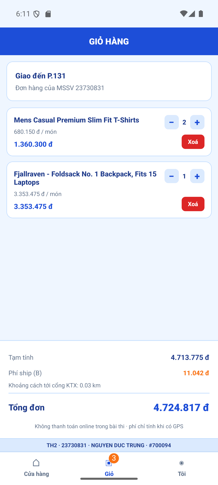

NGUYEN DUC TRUNG | MSSV: 23730831 | Clone HTTPS: https://github.com/ducktrung/23730831_TH2.git | Stamp: #700094 | Số cuối MSSV: 1 | VARIANT: watermark dưới; Login phone; Shop → Giỏ → Tôi; Haptic selection; phí ship B; Detail card.

# KTXGo – Ứng dụng giao hàng tận phòng ký túc xá

**Môn học:** Lập trình cho thiết bị di động – TH2
**Họ tên:** NGUYEN DUC TRUNG
**MSSV:** 23730831
**Dự án:** `KTXGo_23730831`
**Repository:** https://github.com/ducktrung/23730831_TH2

## Giới thiệu

KTXGo là ứng dụng React Native hỗ trợ xem sản phẩm, tìm kiếm, xem chi tiết, thêm vào giỏ hàng và ước tính phí giao hàng đến phòng ký túc xá. Ứng dụng sử dụng dữ liệu sản phẩm từ FakeStoreAPI và tính thông số theo MSSV trong `src/constants/student.ts`.

## Chức năng

- **Đăng nhập:** Màn hình đăng nhập bằng số điện thoại; lưu token mẫu trong Zustand để chuyển từ Auth Stack sang Main Tabs.
- **Cửa hàng:** Hiển thị sản phẩm dạng lưới hai cột bằng FlashList; tìm kiếm có debounce, kéo để làm mới và xử lý trạng thái tải/lỗi mạng.
- **Chi tiết:** Hiển thị ảnh, tên, giá, mô tả sản phẩm; thêm sản phẩm vào giỏ với phản hồi Haptic.
- **Giỏ hàng:** Tăng/giảm số lượng, xóa sản phẩm, tính tiền hàng; lưu giỏ qua AsyncStorage với Zustand Persist.
- **Tài khoản / Vị trí:** Xin quyền vị trí, xử lý trạng thái `granted`, `denied`, `blocked`; tính khoảng cách Haversine và phí giao hàng dự kiến, cho phép mở Cài đặt nếu quyền bị chặn.

## Công nghệ sử dụng

React Native CLI, TypeScript, React Navigation (Stack và Bottom Tabs), FlashList, Axios, TanStack React Query, Zustand, AsyncStorage, Android Location và Haptic Feedback. Giao diện sử dụng `StyleSheet.create` và các mã màu được khai báo trong `src/constants/theme.ts`.

## Dữ liệu và cách tính

- API sản phẩm: `GET https://fakestoreapi.com/products?limit=12`.
- Request Axios gắn header `X-Student-Id: 23730831`.
- Ảnh và tên sản phẩm lấy từ các trường `image` và `title` của API.
- Giá hiển thị: `Math.round(price * PRICE_MULTIPLIER)` và định dạng tiền Việt Nam.
- Với MSSV có chữ số cuối là **1**: `DEBOUNCE_MS = 400`, `STALE_TIME_MS = 21000`, `ROOM_LABEL = P.131`.
- Phí giao hàng dùng **công thức B**: `BASE_SHIP_FEE + Math.round(km * 1500) + 2000`, trong đó `km` là khoảng cách Haversine đến điểm KTX mô phỏng. Các hệ số được lấy từ `student.ts`.

## Cài đặt và chạy ứng dụng

Yêu cầu môi trường React Native CLI, Node.js, Android SDK và Android Emulator đã được cấu hình.

```powershell
npm ci
npm start
```

Mở một terminal khác tại thư mục dự án:

```powershell
npx react-native run-android
```

Ứng dụng cần kết nối mạng để tải sản phẩm. Khi sử dụng vị trí trên máy ảo Android, có thể đặt tọa độ trong phần Location của Emulator.

## Hình ảnh ứng dụng

**Màn hình Cửa hàng**


**Màn hình Giỏ hàng**

